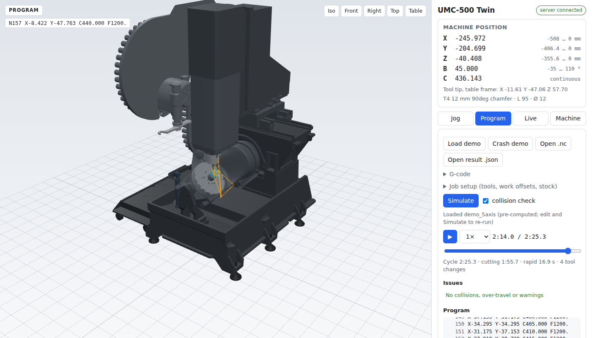

# UMC-500 digital twin

A simulation of our **Haas UMC-500SS** (5-axis trunnion, 120-pocket side-mount tool changer), built from
Haas's own solid model. It's the base layer of a digital twin: the geometry, motion and cutting model that
live machine data and deeper physics plug into.

What it does:

- **Moves like the machine.** X/Y/Z on the spindle, B (tilt) and C (rotary) on the table, in Haas machine
  coordinates, with travel limits.
- **Runs G-code.** Haas-flavoured interpreter:
  - G0–G3, work offsets, tool length, drill cycles, G28/G53;
  - 5-axis **TCPC (G234)** and **DWO (G254)**;
  - **cutter compensation (G41/G42)**, G68 rotation, G10;
  - **subprograms** (M97/M98/M99, G65);
  - **macros**: variables, expressions, IF/GOTO/WHILE and system variables.
- **Realistic cycle times.** A look-ahead planner adds acceleration, cornering and curve-speed limits on
  top of the programmed feeds.
- **Cuts the part.** A voxel material-removal sim shows the part being machined and flags:
  - rapids into material;
  - shank or holder rubbing;
  - cutting with the spindle stopped;
  - gouges, when you give it the finished-part model.
- **Catches crashes before the machine does.** Checks every pose against the real CAD geometry (head, tool
  and holder against the trunnion, platter, base, stock and fixtures).
- **Estimates contour error.** A servo-lag model (position-loop gain and feed-forward per axis) shows where
  corners and tight arcs pull the tool off the programmed path while it's cutting. Set
  `material.tolerance` and the pre-flight check warns on lines that exceed it.
- **Predicts spindle load.** Material removal rate × the work material's cutting energy, set against the
  spindle's power curve, gives load %, torque and cutting force over the program.
- **Talks to the machine.** An MTConnect client (Haas NGC controls can serve MTConnect) drives the live view.
  Runs can be recorded, replayed, and **compared against the simulation** (time, position and spindle load
  per line).
- **Pre-flight checks a folder of programs** and writes a pass/warn/fail HTML report.
- **Calibrates to your machine.** Tape-measure or MRZP (settings 255–257) measurements, axis directions,
  rates and options go into a calibration overlay.
- **Shows it all in 3D** in the browser: jog, playback with the part being cut, toolpath, load chart,
  issue list, live mode and calibration.



## Quick start

```bash
pip install -e ".[collision]"          # numpy, pyyaml, trimesh, python-fcl

# simulate: cycle time, cutting sim, spindle load, over-travel, collisions
python -m umc_twin simulate examples/demo_5axis.nc --setup examples/setup_demo.yaml --out demo.json \
       --stock-out demo_part.stl
python -m umc_twin simulate examples/crash_demo.nc --setup examples/setup_demo.yaml

# 3D viewer + simulation API on http://127.0.0.1:8000
python -m umc_twin serve

pytest                                  # 95 tests
```

More commands (`python -m umc_twin --help`):

| Command | What |
|---|---|
| `simulate PROG --setup JOB` | Report; `--out` result JSON for the viewer, `--stock-out` machined part STL, `--strict` exit 1 on any issue |
| `serve [--mtconnect URL \| --replay PROG \| --replay-log FILE] [--log FILE]` | Viewer + API, with an optional live source |
| `calibrate --nose-to-platter … --mrzp … --b-dir … --c-dir …` | Record measurements from the machine (see below) |
| `mtconnect-probe URL` | What the twin would read from an MTConnect agent, and how it mapped it |
| `record --mtconnect URL --out run.jsonl` | Record the machine; replay with `serve --replay-log run.jsonl` |
| `compare PROG --setup JOB --recording run.jsonl` | Recorded run vs simulation: time, position deviation and spindle load per line |
| `synth-recording PROG --setup JOB --out fake.jsonl` | A fake run (slower, offset, heavier) to try `compare` without the machine |
| `check FILES_OR_FOLDERS --setup JOB --html report.html` | Pre-flight a batch of programs; `prog.yaml` next to `prog.nc` is used for that program |
| `fake-agent --replay PROG --setup JOB` | A fake MTConnect agent serving a simulated run, for testing without the machine |
| `tools FILE` | Tools as the twin understands them, from a Fusion 360 / CSV library or a job setup |
| `pose X Y Z B C --tool N` | Tool position, limits and collisions at one machine position |
| `info`, `refresh-manifest` | Print the machine definition; push config edits into the static viewer |

The viewer also works as plain static files (`web/`). In that mode it can jog, play the bundled examples,
and open result `.json` files from the CLI. Simulating new G-code, calibrating, and live data need the
server.

## Job setup

A small YAML file per job (see `examples/setup_demo.yaml`):

```yaml
units: mm
tool_library: tools.json          # Fusion 360 export or CSV (optional)
tools:                            # add or override; `length` is the H offset (gauge line -> tip)
  1: {name: "12 mm endmill", type: flat, length: 95, diameter: 12, flute_length: 26,
      holder: [[20, 24, 32], [40, 50, 50]]}      # [height, lower dia, upper dia] from the tool up
work_offsets:
  G54: {table_point: [0, 0, -0.8]}               # a point in the table frame, or X/Y/Z machine values
stock: {type: box, size: [100, 80, 50], position: [0, 0, -50.8]}     # or {file: stock.stl, ...}
fixtures:
  - {name: vise, type: vise, model: 5axis, opening: 60, position: [0, 0, -50.8], rotation: [0, 0, 90]}
  - {name: plate, file: fixtures/plate.stl, position: [0, 0, -50.8]}
part: {file: part.stl, position: [0, 0, -50.8]}  # finished part -> gouge check (optional)
material: {name: aluminum_6061, resolution: 0.5} # cutting energy for the load estimate; voxel size (mm)
```

Vises (`type: vise`) come in two generic envelopes, `5axis` (a 125 mm self-centering vise) and `6in`
(a 6″ machine vise). Set `opening` to the jaw gap, or give your own `body: [length, width, height]` and
`jaw: [thickness, height]`. The jaw floor is `height` above `position`.

**Multi-operation jobs:** `simulate op1.nc --stock-out op1.stl` writes the machined part. Use it as the next
operation's stock with `stock: {file: op1.stl, rotation: [180, 0, 0], position: [...]}`. To sit a part
flipped about X on the platter, shift Z by `2 × (−50.8) + part height`.

Tool types are `flat`, `ball`, `bull`, `drill`, `spot` and `chamfer`. For cutter compensation, D uses the
tool's radius unless the tool sets `d_offset`. Use `d_offset: 0` when CAM already offsets the path and D holds
wear only. Mesh files can be STL, OBJ, GLB or
3MF, or STEP with `pip install cadquery-ocp`. The work materials are listed in `umc_twin/physics.py`;
you can also give `specific_energy` in J/mm³ directly.

## How it fits together

```
Haas STEP ──tools/build_assets.py──▶ web/assets/parts/*.glb + machine.json (mesh info, mass props)
config/umc500.yaml (+ calibration.yaml overlay) ── single source of truth for geometry & kinematics
job setup YAML (tools, offsets, stock, fixtures, part, material)
          │
          ▼
  gcode ─▶ timing ─▶ material ─▶ physics ─▶ collision ─▶ sim.run_job ─▶ JSON ─▶ web viewer
 (moves)  (accel)   (voxel cut)  (load)     (FCL)                          ▲
                                                                          │ /api/live (SSE)
                         live sources: MTConnect · replay · recording ────┘
```

| Path | What |
|---|---|
| `config/umc500.yaml` | Machine definition: frames, joints, limits, rates, accelerations, spindle ratings, parts, options. **Start here.** |
| `config/calibration.yaml` | Your machine's measurements (written by `calibrate`; not present until you calibrate) |
| `umc_twin/kinematics.py` | Forward kinematics (single and batched), TCP inverse, work-offset helpers |
| `umc_twin/gcode.py`, `macro.py` | G-code interpreter → `Trajectory`; macro variables and expressions |
| `umc_twin/timing.py` | Look-ahead planner: acceleration and cornering |
| `umc_twin/material.py` | Voxel cutting sim, cutting checks, machined-part mesh |
| `umc_twin/physics.py` | Spindle power / load / torque / cutting force |
| `umc_twin/servo.py` | Servo lag → contour error (tune `servo:` in the config from a ballbar test) |
| `umc_twin/collision.py` | Mesh collision checks along a trajectory |
| `umc_twin/job.py`, `toollib.py`, `cadio.py` | Job setup, tool shapes and libraries, mesh file loading |
| `umc_twin/calibration.py` | Measurements → calibration overlay |
| `umc_twin/compare.py`, `check.py` | Commanded vs actual comparison; batch pre-flight report |
| `umc_twin/live.py`, `mtconnect.py`, `mtconnect_agent.py` | Live sources, MTConnect client, fake agent, recording |
| `umc_twin/server.py` | Viewer + API (`/api/simulate`, `/api/live`, `/api/calibrate`). Standard library only |
| `web/` | Viewer (three.js vendored, so it runs offline on a shop PC) |
| `examples/` | 5-axis demo (facing, helical pocket, 3+2 holes, TCPC chamfer), macro + cutter comp demo, crash demo, job setup |

## Frames and conventions

- **World = machine frame**: Z up, +X right, +Y toward the back, mm. The origin is where the B and C axes
  intersect (the pivot, like Haas's MRZP). The platter top is at Z −50.8 (2″ below the B axis).
- **Joints = Haas MACHINE coordinates**: X/Y/Z are 0 at home and travel negative. B is −35° to +110°;
  C is continuous.
- **Tool length** is measured from the spindle gauge line (nose face).
- **Work offsets** can be machine values (`X/Y/Z`, like the offsets page) or a `table_point` in the table
  frame.

## Calibrating to the machine

These can all be done in the viewer's **Calibrate** tab or with `python -m umc_twin calibrate`. Results go
to `config/calibration.yaml`, merged over the CAD model; delete that file to go back.

1. **Spindle height.** Best: copy **settings 255 / 256 / 257 (MRZP)** from the control
   (`--mrzp X Y Z --units in`). From the CAD, the twin predicts about −9.941 / −8.059 / −8.287 in. If your
   control is close to that, the model already fits. Otherwise: home the machine, set B0, and measure spindle
   nose to platter top (`--nose-to-platter`; the model says 261.3 mm / 10.29 in).
2. **B direction.** At home, jog B+ (`--b-dir right|left`). The CAD strongly suggests *right*, because the
   other direction would crash the cradle into the spindle at home.
3. **C direction.** Jog C+ and look down (`--c-dir cw|ccw`).
4. **Rates.** B/C max speed and tool-change time, from the machine parameters. Linear rapid, accelerations,
   corner time and spindle ratings are spec-sheet placeholders in `config/umc500.yaml`. Tune them until
   simulated cycle times and load match real runs.
5. **Options.** Set spindle, platter etc. in the Machine tab, then press "Save as my machine"
   (or `calibrate --option spindle=hsk`).

## Connecting the machine

```bash
python -m umc_twin mtconnect-probe http://<agent-host>:<port>     # check what it finds
python -m umc_twin serve --mtconnect http://<agent-host>:<port> --log runs/today.jsonl
```

The client picks the actual machine positions of the X/Y/Z and B/C axes, the spindle speed and load, and the
program, line, tool and execution state from the agent's `/probe`. If it guesses wrong, pin data item ids
under `live.mtconnect` in the config. It was tested end to end against the bundled fake agent; it has not
yet been tried on this machine's agent. Once live data flows, record a run and compare it with the simulation:

```bash
python -m umc_twin record --mtconnect http://<agent-host>:<port> --out runs/part12.jsonl
python -m umc_twin compare part12.nc --setup part12.yaml --recording runs/part12.jsonl
```

The comparison lists where the real machine was slower or faster than the sim (tune accelerations and corner
time from that), how far it strayed from the simulated path (a wrong offset or calibration shows up here),
and a factor for `material.specific_energy` that makes the predicted spindle load match. The factor is a
line-averaged fit, good to roughly ±10%. It assumes the control reports program line numbers; if it
reports N-numbers, the report says no lines matched.

## Limitations

- **Cutting sim resolution.** Features smaller than about one voxel (default ~0.6 mm on a 100 mm part) are
  not resolved. Raise `material.resolution` for detail, at the cost of time.
- **Load estimate.** Uses handbook cutting energies and a placeholder spindle curve, and ignores tool wear,
  chip thinning, and runout. It is an estimate until tuned against the machine's reported load.
- **Collisions.** Mesh collisions are detected at surface contact. A body can't sit entirely inside another
  without the check noticing on the way in, because paths are checked every 2 mm / 1°.
- **Timing and servo.** The planner is a generic look-ahead model, not Haas's servo control. G187 smoothing
  isn't modelled. The contour-error model is a first-order position loop with feed-forward; its gains are
  placeholders until checked with a ballbar test.
- **G-code.** The interpreter warns and skips what it doesn't know. Cutter compensation works in the G17
  plane only; an inside corner next to an arc is approximated (with a warning). Probing (G31) and tool wear
  offsets are not simulated.
- **Tool library import.** The Fusion 360 import follows Fusion's export format but hasn't been checked
  against this shop's export yet. When a library tool has no holder, a default 45 mm holder is assumed.
  Measured H offsets in `tools:` should win.
- **Mass properties** in `machine.json` assume solid cast iron. They're reasonable for the castings, but
  meaningless for sheet-metal parts.

## Rebuilding the meshes

The raw CAD isn't committed (80 MB). Download the UMC-500 solid model from Haas and run:

```bash
pip install cadquery-ocp
python tools/build_assets.py --zip path/to/umc-500_ss_smtc120_solid_models_04_2026.zip
python tools/build_examples.py     # refresh the pre-computed viewer examples
```

If you change the B/C sign convention, re-run `examples/make_demo.py`, because the demo's 5-axis angles are
computed from the kinematics.
